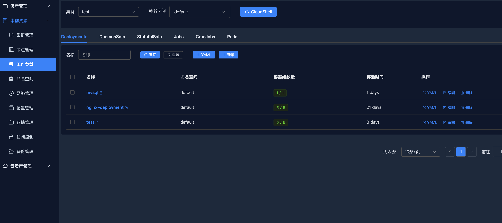

# k8s-platform
=======
# k8s多集群管理平台

### 1、基本介绍 

多集群资源管理平台，基于管理k8s的资源开发，可以管理k8s的namespace、Deployment、Daemonset、StatefulSet、Service、Ingress、Pods、Nodes、CronJob、Velero等，并且支持终端等功能。

**功能详细说明**：

1. K8S原生资源管理，多集群管理，提供表单资源管理，YAML方式管理，终端管理等能力。
2. 平台 用户与Kubernetes RBAC打通，提供个人凭据申请，集群用户管理，集群用户授权，集群权限管理能力。
3. 阿里云开源控制器Openkruise管理能力。
4. 集成Prometheus 监控能力（未完成）。
5. 集成CloudTTY 能力。(CloudTTY 是专为 Kubernetes 云原生环境打造的 Web 终端和 Cloud Shell Operator。 通过 CloudTTY，操控多云资源。）
6. NodeShell 能力。
7. 提供多云资产管理功能，目前包括阿里云、腾讯云、华为云，主要包括云上负载均衡、云服务器、云数据库。
8. 提供本地资产管理，可根据项目隔离主机，批量导入主机（未完成）

方便运维对Kubernetes集群资源的细粒度授权，方便开发管理Kubernetes内的应用对其进行故障排查，提供友好的操作页面降低使用复杂性。

### 2、技术栈

该项目前后端分离，前端vue3、后端使用golang开发

涉及技术栈有：

1、gin：web框架

2、gorm：orm库

3、CasBin：访问控制中间件

4、client-go：k8s api客户端

### 3、项目部署

docker-compose

```shell
version: "3.4"

networks:
  network:
    ipam:
      driver: default
      config:
        - subnet: '177.7.0.0/16'

volumes:
  mysql:

services:
  web:
    container_name: k8s-web
    image: registry.cn-hangzhou.aliyuncs.com/dyclouds/k8s-front:latest
    restart: always
    ports:
      - '8080:8080'
    depends_on:
      - server
    command: [ 'nginx-debug', '-g', 'daemon off;' ]
    networks:
      network:
          ipv4_address: 177.7.0.11

  mysql:
    image: registry.cn-hangzhou.aliyuncs.com/dyclouds/dycloud-mysql:5.7
    container_name: dycloud-mysql
    command: mysqld --character-set-server=utf8mb4 --collation-server=utf8mb4_unicode_ci
    restart: always
    ports:
      - "3306:3306"
    environment:
      MYSQL_ROOT_PASSWORD: '123456'
    volumes:
      - mysql:/var/lib/mysql
    networks:
      network:
          ipv4_address: 177.7.0.13
    healthcheck:
      test: ["CMD-SHELL", "mysqladmin ping -uroot -p123456"]
      interval: 10s
      timeout: 5s
      retries: 5

  server:
    container_name: k8s-server
    image: registry.cn-hangzhou.aliyuncs.com/dyclouds/k8s-backend:latest
    restart: always
    ports:
      - '8888:8888'
    depends_on:
      - mysql
      - redis
    networks:
      network:
          ipv4_address: 177.7.0.12
    healthcheck:
      test: ["CMD", "nc",  "mysql", "3306"]
      interval: 10s
      timeout: 5s
      retries: 3

  redis:
    image: registry.cn-hangzhou.aliyuncs.com/dyclouds/redis:7.0
    container_name: dycloud-redis
    restart: always
    volumes:
      - /root/clash/redis.conf:/usr/local/etc/redis/redis.conf
    ports:
      - "6379:6379"
    command: ["sh", "-c", "mkdir -p /var/lib/redis && redis-server /usr/local/etc/redis/redis.conf"]
    ports:
      - '6379:6379'
    networks:
      network:
          ipv4_address: 177.7.0.14
    healthcheck:
      test: ["CMD", "redis-cli", "ping"]
      interval: 10s
      timeout: 5s
      retries: 3
```
### 测试账号： public/123456





